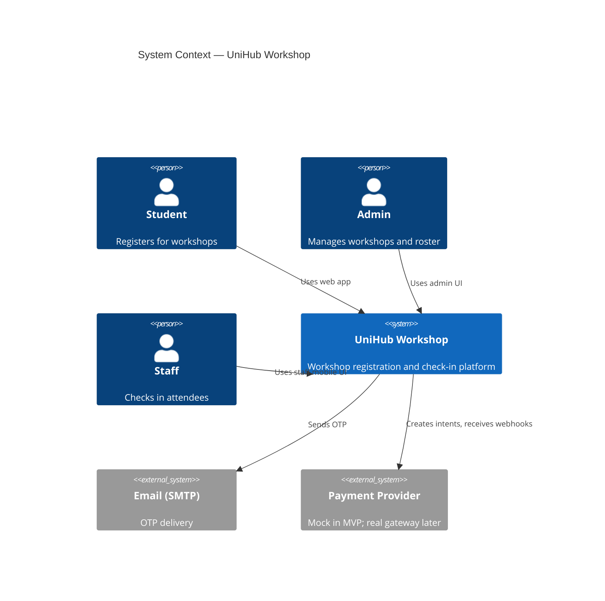
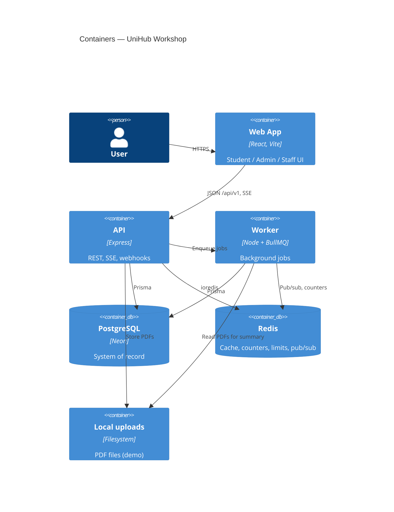

# UniHub Workshop — Technical Design

## Architectural Style

**Modular monolith + async workers** on a TypeScript/npm workspaces monorepo.


| Choice                     | Rationale                                                                                        |
| -------------------------- | ------------------------------------------------------------------------------------------------ |
| Single API process         | Lowest ops overhead for course timeline; modules still enforce boundaries                        |
| Separate `apps/worker`     | BullMQ processors must not block HTTP threads; payment and registration work is inherently async |
| PostgreSQL (Neon) + Prisma | Relational integrity for registrations, users, workshops; Prisma for team speed                  |
| Redis                      | Seat counters, list cache, rate limits, idempotency, SSE pub/sub                                 |
| BullMQ                     | Registration, email OTP, payment timeout, notifications, AI summary jobs                         |
| Responsive web only        | One codebase for student/admin/staff; staff offline via `localStorage` sync                      |


## C4 Diagrams

### Level 1 — System Context




### Level 2 — Containers




## High-Level Architecture

```text
┌─────────────┐     Bearer JWT + cookies      ┌──────────────────────────────────────┐
│  Frontend   │ ───────────────────────────►│             Backend (Express)          │
│  React/Vite │     SSE /notifications/stream │    middleware → modules → infra      │
└─────────────┘                               └───────────┬──────────────────────────┘
       │ localStorage                                      │ enqueue
       │ (offline check-in)                                ▼
       │                                         ┌─────────────────┐
       └──────── POST /check-ins/batch ────────►│  apps/worker    │
                                                 │  BullMQ workers │
                                                 └────────┬────────┘
                                                          │
                    ┌─────────────────────────────────────┼─────────────────────┐
                    ▼                     ▼               ▼                     ▼
              PostgreSQL              Redis          SMTP (OTP)          Mock payment
```

### Critical flow: Registration (happy path)

```text
Student → POST /api/v1/workshops/:id/register (+ x-idempotency-key)
  1. Rate limit (per user)
  2. Idempotency middleware (Redis)
  3. Auth: role STUDENT, ACTIVE StudentRecord
  4. Validate workshop PUBLISHED, registration window (if set)
  5. Redis DECR workshop:{id}:slots → if < 0, INCR and return Status 400 Workshop Full
  6. Enqueue registration-queue → 202 { jobId }

Worker (registration.processor):
  7. TX: UPDATE workshops SET available_slots = available_slots - 1 WHERE > 0
  8. INSERT registration (PENDING → HOLDING or PAID)
  9. If paid: paymentBreaker.createIntent OR free → PAID + qrStub + notification job
 10. On DB failure: INCR Redis, fail job
```

### Critical flow: Offline check-in sync

```text
Staff Scan (offline) → queue in localStorage (clientId, qrToken, workshopId, scannedAt)
On online → POST /api/v1/check-ins/batch
  → TX per batch; idempotent if checkedInAt already set
  → Response: syncedIds[], failedIds[] for client retry/backoff
```

## API Boundaries

All public HTTP APIs use prefix `**/api/v1**`. Route composition lives in `apps/api/src/routes/index.ts`.


| Boundary          | Base path                                                   | Auth                    | Roles             | Responsibility                           |
| ----------------- | ----------------------------------------------------------- | ----------------------- | ----------------- | ---------------------------------------- |
| Auth              | `/api/v1/auth`                                              | Public (rate-limited)   | —                 | OTP request/verify, refresh, logout      |
| Student workshops | `/api/v1/workshops`                                         | Bearer JWT              | STUDENT           | List/detail published workshops          |
| Registration      | `/api/v1/workshops/:id/register`, `/api/v1/registrations/*` | Bearer JWT              | STUDENT           | Register, list own, job status, mock pay |
| Payments webhook  | `/api/v1/payments/webhook/:provider`                        | Signature + idempotency | —                 | Finalize HOLDING → PAID/FAILED           |
| Admin workshops   | `/api/v1/admin/workshops`                                   | Bearer JWT              | ADMIN             | CRUD, stats, registration window         |
| Admin PDF / AI    | `/api/v1/admin/workshops/:id/pdf`                           | Bearer JWT              | ADMIN             | Upload PDF, enqueue summary job          |
| Student import    | `/api/v1/admin/import`                                      | Bearer JWT              | ADMIN             | CSV upload, import logs                  |
| Check-in          | `/api/v1/check-ins/*`                                       | Bearer JWT              | STAFF, ADMIN      | verify, single, batch                    |
| Notifications     | `/api/v1/notifications`                                     | Bearer JWT              | All authenticated | list, mark read; `/stream` SSE           |


**Cross-cutting middleware** (order matters per route):

- `authenticate` / `authenticateSSE` — JWT verify (no DB on access token)
- `requireRole(...)` — RBAC
- `idempotency` — registration + webhook writes
- Rate limiters: global IP, auth IP, registration per-user

**Worker queues** (contract in `packages/shared`):


| Queue                | Producer            | Consumer                  | Purpose                       |
| -------------------- | ------------------- | ------------------------- | ----------------------------- |
| `registration-queue` | API                 | registration.processor    | DB seat + payment intent      |
| `payment-timeout`    | registration worker | payment-timeout.processor | Expire HOLDING → release seat |
| `email-otp`          | API                 | mail.processor            | Send OTP                      |
| `notification-queue` | Workers             | notification.processor    | Persist + Redis pub/sub SSE   |
| `ai-summary`         | API                 | ai-summary.processor      | PDF parse + mock summary      |


**Module ↔ infra rule:** Domain modules call services/repositories; they do not import payment/Redis clients directly except through `apps/api/src/infra/`* adapters.

## Database Schema Logic

PostgreSQL via Prisma (`packages/db/prisma/schema.prisma`). Naming: snake_case columns, UUID primary keys.

### Entity relationships (logical)

```text
User 1──* Registration *──1 Workshop
User 1──* OtpToken, RefreshToken, Notification
StudentRecord (standalone roster; keyed by email / student_id)
ImportLog (CSV job audit)
```

### Core invariants


| Entity                   | Invariant                                                                                                                                  |
| ------------------------ | ------------------------------------------------------------------------------------------------------------------------------------------ |
| **Workshop**             | `available_slots <= capacity`; only `PUBLISHED` visible to students; optional `registrationOpenAt` / `registrationCloseAt`                 |
| **Registration**         | Unique `(userId, workshopId)`; `idempotencyKey` unique; status enum drives lifecycle                                                       |
| **RegStatus**            | `PENDING` → worker processing; `HOLDING` awaiting payment; `PAID` eligible for check-in; `EXPIRED`/`FAILED`/`CANCELLED` release seat logic |
| **Registration.checkIn** | `checkedInAt` set only when `status = PAID`; updates are idempotent                                                                        |
| **StudentRecord**        | `status = ACTIVE` required for student OTP + register                                                                                      |
| **Notification**         | Owned by `userId`; optional `idempotencyKey` for worker dedup                                                                              |


### Seat accounting

- **Authoritative:** `workshops.available_slots` decremented in worker transaction.
- **Fast path:** Redis key `workshop:{id}:slots` initialized on publish/admin update; DECR at API gate; INCR on worker failure or payment expiry processor.
- **List API:** Cached published list `workshops:published` (5 min TTL); per-item slots via `MGET workshop:{id}:slots`.

### Registration status machine

```text
PENDING ──worker──► HOLDING ──webhook success──► PAID
                  └─ free workshop ─────────────► PAID
HOLDING ──timeout──► EXPIRED (seat released)
HOLDING ──webhook fail──► FAILED (seat released)
Any ──cancel──► CANCELLED (app may delete/update row for re-register)
```

## Access Control Design


| Role        | Capabilities                                                                |
| ----------- | --------------------------------------------------------------------------- |
| **STUDENT** | `GET /workshops`, register, own registrations, notifications, mock payment  |
| **ADMIN**   | All admin workshop CRUD, CSV import, PDF upload, reports/stats on workshops |
| **STAFF**   | Staff workshop desk, check-in verify/batch; no workshop CRUD                |


Enforcement layers:

1. **Route registration** — `requireRole` on router groups.
2. **Resource ownership** — Registration list/filter always scoped to `sub` from JWT.
3. **Roster gate** — `StudentRecord` check for STUDENT OTP and registration (403 if missing/inactive).

Tokens:

- Access JWT: 15 min, payload `sub`, `role` — verified without DB.
- Refresh token: httpOnly cookie (web), hashed in `RefreshToken` with `familyId` for rotation/reuse detection.

## System Protection Mechanisms

### Burst traffic (rate limiting)

Stored in Redis (`express-rate-limit` + Redis store):

- Global: 100 req / 60s per IP
- Auth: 5 req / 60s per IP
- Registration: 10 req / 60s per authenticated user
- Elevated tiers for STAFF/ADMIN (per OpenSpec)

On `429`: `Retry-After` header; no downstream work.

### Unstable payment gateway

`opossum` circuit breaker wraps `PaymentProvider.createIntent` in the worker:

- Timeout 5s; open circuit on sustained failures
- **Fallback:** registration stays `HOLDING` without `paymentRef`; student notified to retry; `payment-timeout` job still scheduled

Browse/read paths (`GET /workshops`) never call payment adapter.

### Double charge / duplicate registration

- **Client:** `x-idempotency-key` required on `POST .../register`
- **Server:** Redis `idempotency:{key}` — `IN_PROGRESS` → 409; `DONE` → replay stored response
- **DB:** `registrations.idempotency_key` UNIQUE
- **Webhook:** same idempotency middleware

TTL: 24 hours.

## Architecture Decision Records (ADR)


| #   | Decision                                            | Why                                                                   | Trade-off                                              |
| --- | --------------------------------------------------- | --------------------------------------------------------------------- | ------------------------------------------------------ |
| 1   | Modular monolith vs microservices                   | 2 devs; one deploy artifact                                           | Harder to scale teams independently later              |
| 2   | JWT access + DB refresh rotation vs server sessions | No DB hit per request at 12k spike; staff can cache token for offline | Cannot revoke access token instantly without blocklist |
| 3   | Redis + DB two-tier seats vs DB-only                | Avoids row lock storm on hot workshop                                 | Must reconcile Redis on worker failure                 |
| 4   | BullMQ async registration vs sync TX in API         | Sub-200ms 202 response under load                                     | Client polls/notifications for final state             |
| 5   | Mock payment provider vs real gateway               | Demo-safe; satisfies course payment flow                              | Production needs new adapter + secrets                 |
| 6   | SSE vs WebSocket for notifications                  | One-way push is enough; simpler                                       | No bidirectional channel                               |
| 7   | localStorage offline queue vs SW/IndexedDB          | Meets offline check-in without SW complexity                          | Queue limited to one browser; no background sync       |
| 8   | Local PDF storage vs S3                             | Fast to ship for course                                               | Not durable across redeploys                           |
| 9   | Prisma + Neon PostgreSQL vs NoSQL                   | Strong constraints on registrations/seats                             | Connection limits need pooling awareness               |


## CI/CD and Quality Gates

### Current (repository)


| Mechanism              | Scope                                                                   |
| ---------------------- | ----------------------------------------------------------------------- |
| **Husky** `pre-commit` | Runs `lint-staged`                                                      |
| **lint-staged**        | `apps/api/src/**/*.ts` → format + lint                                  |
| **npm scripts**        | `build:api`, `build:worker`, `build:web`, `build:shared`, `db:generate` |
| **Manual**             | `docs/smoke-tests.http` for API smoke checks                            |


## Alignment with OpenSpec


| Area                           | Canonical detail                                   |
| ------------------------------ | -------------------------------------------------- |
| Requirements (Given/When/Then) | `openspec/specs/`*                                 |
| In-flight work                 | `openspec/changes/*`                               |
| Architecture (this file)       | `blueprint/design.md`                              |
| Feature behavior specs         | `blueprint/specs/*.md` — **after design approval** |


Active changes to incorporate in implementation (not duplicated as feature specs here): `add-offline-checkin-queue`, `persistent-notifications`, `implement-ai-summary-feature`, `add-registration-window`, `build-staff-qr-checkin-scan`.