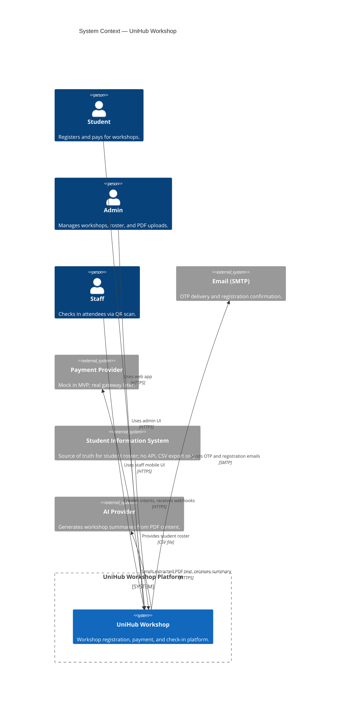
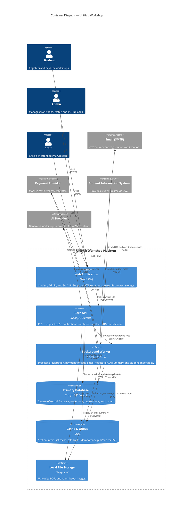
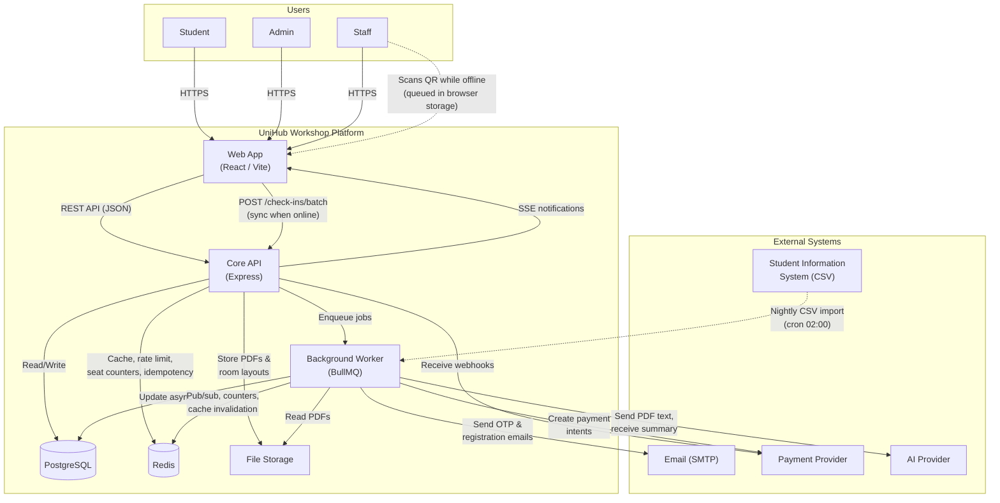

# UniHub Workshop — Technical Design

## Architectural Style

**Modular monolith + async workers** on a TypeScript/npm workspaces monorepo.


| Choice                     | Rationale                                                                                        |
| -------------------------- | ------------------------------------------------------------------------------------------------ |
| Single API process         | Lowest ops overhead for course timeline; modules still enforce boundaries                        |
| Separate Workers           | BullMQ processors must not block HTTP threads; payment and registration work is inherently async |
| PostgreSQL (Neon) + Prisma | Relational integrity for registrations, users, workshops; Prisma for team speed                  |
| Redis                      | Seat counters, list cache, rate limits, idempotency, SSE pub/sub                                 |
| BullMQ                     | Registration, email OTP, payment timeout, notifications, AI summary jobs                         |
| Responsive web only        | One codebase for student/admin/staff; staff offline via `localStorage` sync                      |


## C4 Diagrams

### Level 1 — System Context
*This diagram shows UniHub in the center and the external entities it interacts with.*




### Level 2 — Containers
*This diagram breaks down the UniHub system into its deployable containers.*



## High-Level Architecture

*This diagram shows data flow and dependencies between components, highlighting integration points and the offline check-in flow.*



### Critical flow: Registration (happy path)

```text
Student → POST /api/v1/workshops/:id/register (+ x-idempotency-key)
  1. Rate limit (per user)
  2. Idempotency middleware (Redis)
  3. Auth: role STUDENT, ACTIVE StudentRecord
  4. Validate workshop PUBLISHED, registration window (if set)
  5. Redis decrease slot counter → if < 0, increase counter and return Status 400 Workshop Full
  6. Enqueue registration-queue → 202 { jobId }

Worker (registration processor):
  7. Atomically decrement the workshop's available slots in the database (only if slots remain)
  8. Create the registration record (transitions from PENDING to HOLDING or PAID)
  9. For paid workshops: request a payment intent via circuit breaker; for free workshops: mark as PAID, generate QR stub, and enqueue a notification
 10. On database failure: restore the Redis slot counter and fail the job for retry
```

### Critical flow: Offline check-in sync

```text
1. While offline, the staff member scans QR codes and the web app queues each scan locally in browser storage
2. When connectivity is restored, the app sends the queued scans to the batch check-in endpoint
3. The server processes each item in a transaction; scans that were already checked in are treated as idempotent successes
4. The response separates successfully synced IDs from failed IDs so the client can retry or surface errors
```


**Cross-cutting middleware** (order matters per route):

- `authenticate` / `authenticateSSE` — JWT verify (no DB on access token)
- `requireRole(...)` — RBAC
- `idempotency` — registration + webhook writes
- Rate limiters: global IP, auth IP, registration per-user

**Worker queues**:


| Queue                | Producer            | Consumer                  | Purpose                       |
| -------------------- | ------------------- | ------------------------- | ----------------------------- |
| `registration-queue` | API                 | Registration processor    | DB seat + payment intent      |
| `payment-timeout`    | Registration worker | Timeout processor         | Expire HOLDING → release seat |
| `email-otp`          | API                 | Mail processor            | Send OTP                      |
| `notification-queue` | Workers             | Notification processor    | Persist + pub/sub for SSE     |
| `ai-summary`         | API                 | AI summary processor      | PDF parse + summary           |
| `student-import`     | API / Cron (02:00)  | Import processor          | CSV roster upsert             |


**Module ↔ infra rule:** Domain modules call services/repositories; they do not import infrastructure clients (payment, cache, queue) directly — they go through infra adapters.

## Database Schema Logic

PostgreSQL via Prisma ORM. Naming: snake_case columns, UUID primary keys.

### Entity relationships (logical)

```text
User 1──* Registration *──1 Workshop
User 1──* OtpToken, RefreshToken, Notification
StudentRecord (standalone roster; keyed by email / student_id)
ImportLog (CSV job audit)
```

### Core invariants


| Entity                   | Invariant                                                                                                                                  |
| ------------------------ | ------------------------------------------------------------------------------------------------------------------------------------------ |
| **Workshop**             | `available_slots <= capacity`; only `PUBLISHED` visible to students; optional `registrationOpenAt` / `registrationCloseAt`                 |
| **Registration**         | Unique `(userId, workshopId)`; `idempotencyKey` unique; status enum drives lifecycle                                                       |
| **RegStatus**            | `PENDING` → worker processing; `HOLDING` awaiting payment; `PAID` eligible for check-in; `EXPIRED`/`FAILED`/`CANCELLED` release seat logic |
| **Registration.checkIn** | `checkedInAt` set only when `status = PAID`; updates are idempotent                                                                        |
| **StudentRecord**        | `status = ACTIVE` required for student OTP + register                                                                                      |
| **Notification**         | Owned by `userId`; optional `idempotencyKey` for worker dedup                                                                              |


### Seat accounting

- **Authoritative:** `workshops.available_slots` decremented in worker transaction.
- **Fast path:** Redis slot counter initialized on publish/admin update; DECR at API gate; INCR on worker failure or payment expiry.
- **List API:** Cached published list (5 min TTL); live slot counts merged from Redis via batch lookup.

### Registration status machine

```text
PENDING ──worker──► HOLDING ──webhook success──► PAID
                  └─ free workshop ─────────────► PAID
HOLDING ──timeout──► EXPIRED (seat released)
HOLDING ──webhook fail──► FAILED (seat released)
Any ──cancel──► CANCELLED (app may delete/update row for re-register)
```

## Access Control Design


| Role        | Capabilities                                                                |
| ----------- | --------------------------------------------------------------------------- |
| **STUDENT** | `GET /workshops`, register, own registrations, notifications, mock payment  |
| **ADMIN**   | All admin workshop CRUD, CSV import, PDF upload, reports/stats on workshops |
| **STAFF**   | Staff workshop desk, check-in verify/batch; no workshop CRUD                |


Enforcement layers:

1. **Route registration** — `requireRole` on router groups.
2. **Resource ownership** — Registration list/filter always scoped to `sub` from JWT.
3. **Roster gate** — `StudentRecord` check for STUDENT OTP and registration (403 if missing/inactive).

Tokens:

- Access JWT: 15 min, payload `sub`, `role` — verified without DB.
- Refresh token: httpOnly cookie (web), hashed in `RefreshToken` with `familyId` for rotation/reuse detection.

## System Protection Mechanisms

### Burst traffic (rate limiting)

Stored in Redis (rate-limit middleware + Redis store):

- Global: 100 req / 60s per IP
- Auth: 5 req / 60s per IP
- Registration: 10 req / 60s per authenticated user
- Elevated tiers for STAFF/ADMIN (per OpenSpec)

On `429`: `Retry-After` header; no downstream work.

### Unstable payment gateway

Circuit breaker wraps `PaymentProvider.createIntent` in the worker:

- Timeout 5s; open circuit on sustained failures
- **Fallback:** registration stays `HOLDING` without `paymentRef`; student notified to retry; `payment-timeout` job still scheduled

Browse/read paths (`GET /workshops`) never call payment adapter.

### Double charge / duplicate registration

- **Client:** `x-idempotency-key` required on `POST .../register`
- **Server:** Redis-backed claim lock — in-progress → 409; completed → replay stored response
- **DB:** `registrations.idempotency_key` UNIQUE
- **Webhook:** same idempotency mechanism

TTL: 24 hours.

## Architecture Decision Records (ADR)


| #   | Decision                                            | Why                                                                   | Trade-off                                              |
| --- | --------------------------------------------------- | --------------------------------------------------------------------- | ------------------------------------------------------ |
| 1   | Modular monolith vs microservices                   | 2 devs; one deploy artifact                                           | Harder to scale teams independently later              |
| 2   | JWT access + DB refresh rotation vs server sessions | No DB hit per request at 12k spike; staff can cache token for offline | Cannot revoke access token instantly without blocklist |
| 3   | Redis + DB two-tier seats vs DB-only                | Avoids row lock storm on hot workshop                                 | Must reconcile Redis on worker failure                 |
| 4   | BullMQ async registration vs sync TX in API         | Sub-200ms 202 response under load                                     | Client polls/notifications for final state             |
| 5   | Mock payment provider vs real gateway               | Demo-safe; satisfies course payment flow                              | Production needs new adapter + secrets                 |
| 6   | SSE vs WebSocket for notifications                  | One-way push is enough; simpler                                       | No bidirectional channel                               |
| 7   | localStorage offline queue vs SW/IndexedDB          | Meets offline check-in without SW complexity                          | Queue limited to one browser; no background sync       |
| 8   | Local PDF storage vs S3                             | Fast to ship for course                                               | Not durable across redeploys                           |
| 9   | Prisma + Neon PostgreSQL vs NoSQL                   | Strong constraints on registrations/seats                             | Connection limits need pooling awareness               |


## CI/CD and Quality Gates

### Current (repository)


| Mechanism              | Scope                                                                   |
| ---------------------- | ----------------------------------------------------------------------- |
| **Husky** `pre-commit` | Runs lint-staged                                                        |
| **lint-staged**        | API source files → format + lint                                        |
| **npm scripts**        | Build commands for api, worker, web, shared packages, DB codegen        |
| **Manual**             | HTTP file for API smoke checks                                           |
